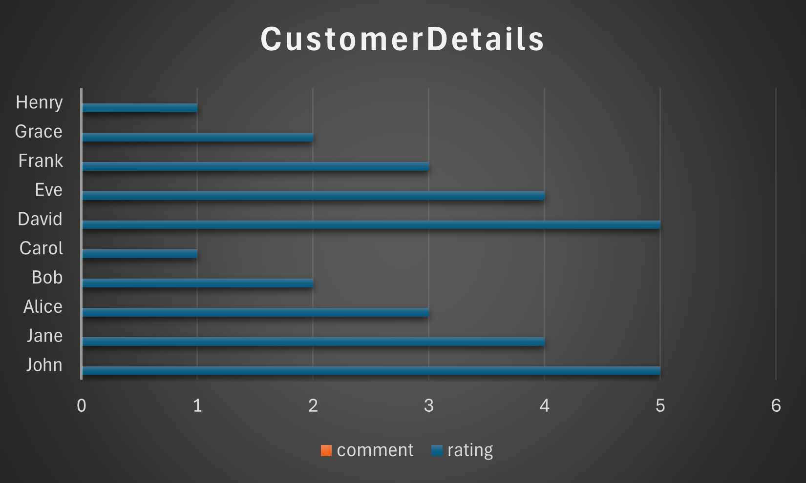
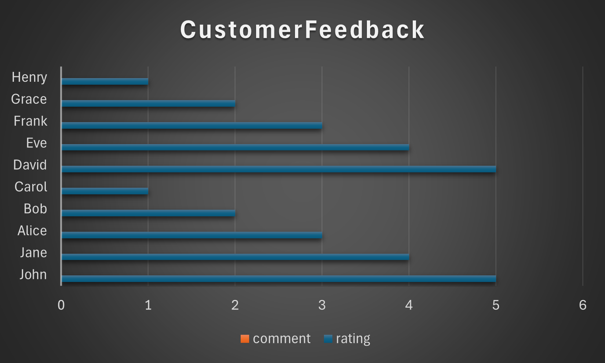
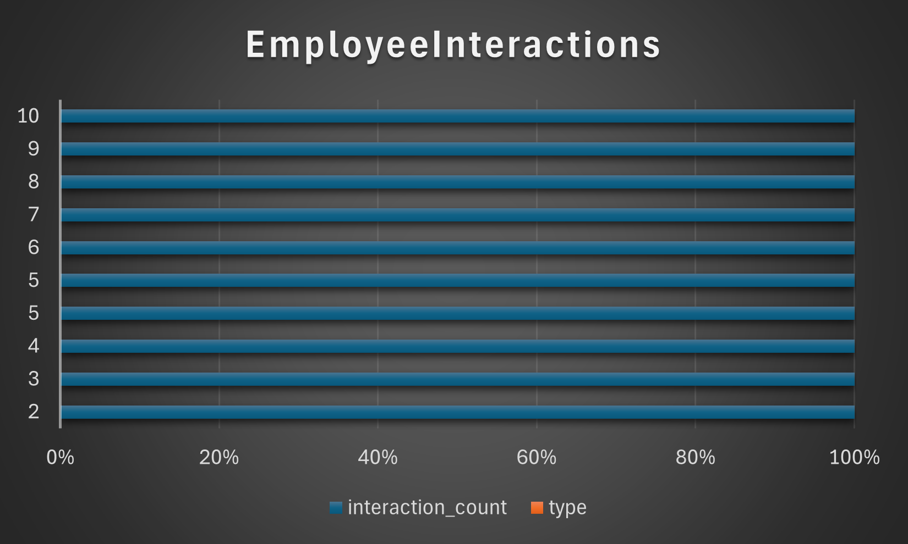
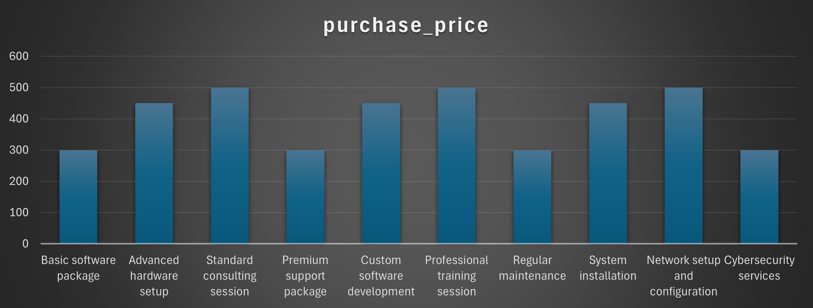
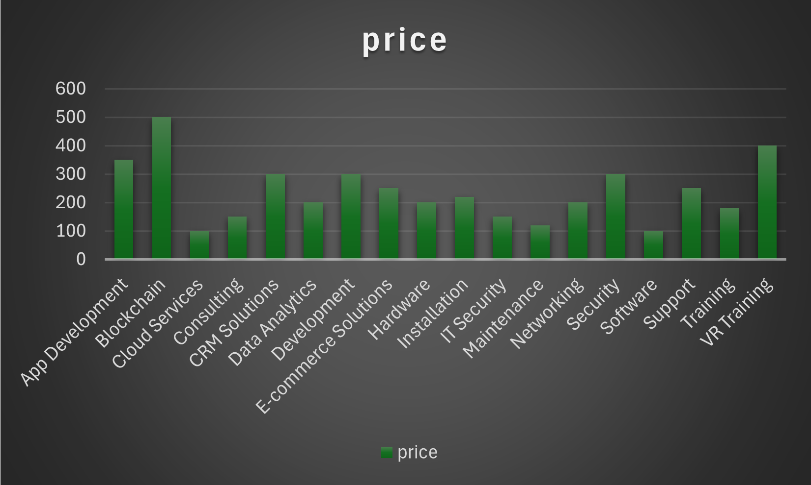

# Curso SQL - Coderhouse

## Entrega Final

- REALIZADO POR THAYROV GARCÍA

---

### Índice

- [Curso SQL - Coderhouse](#curso-sql---coderhouse)
  - [Entrega Final](#entrega-final)
    - [Índice](#índice)
  - [Introducción - Administración de la Relación con el Cliente (CRM)](#introducción---administración-de-la-relación-con-el-cliente-crm)
    - [Situación problemática](#situación-problemática)
    - [Modelo de negocio](#modelo-de-negocio)
    - [Objetivo Principal](#objetivo-principal)
    - [Objetivos Secundario](#objetivos-secundario)
    - [Diagrama de entidad relación:](#diagrama-de-entidad-relación)
  - [Descripción de tablas](#descripción-de-tablas)
    - [Tabla customer_dim](#tabla-customer_dim)
    - [Tabla employee_dim](#tabla-employee_dim)
    - [Tabla service_dim](#tabla-service_dim)
    - [Tabla service_category_dim](#tabla-service_category_dim)
    - [Tabla time_dim](#tabla-time_dim)
    - [Tabla interaction_fact](#tabla-interaction_fact)
    - [Tabla purchase_fact](#tabla-purchase_fact)
    - [Tabla purchase_detail_fact](#tabla-purchase_detail_fact)
    - [Tabla customer_preferences_dim](#tabla-customer_preferences_dim)
    - [Tabla customer_feedback_fact](#tabla-customer_feedback_fact)
    - [Tabla purchase_log](#tabla-purchase_log)
    - [Tabla feedback_log](#tabla-feedback_log)
  - [Listado de Vistas](#listado-de-vistas)
    - [Vista: CustomerDetails](#vista-customerdetails)
    - [Vista: EmployeeInteractions](#vista-employeeinteractions)
    - [Vista: SalesSummary](#vista-salessummary)
    - [Vista: ServicesByCategory](#vista-servicesbycategory)
    - [Vista: CustomerFeedback](#vista-customerfeedback)
  - [Listado de Funciones](#listado-de-funciones)
    - [Función: TotalVentasCliente](#función-totalventascliente)
    - [Función: CantidadInteraccionesPorTipo](#función-cantidadinteraccionesportipo)
  - [Listado de Stored Procedures](#listado-de-stored-procedures)
    - [Stored Procedure: OrdenarTabla](#stored-procedure-ordenartabla)
    - [Stored Procedure: InsertarEliminarCliente](#stored-procedure-insertareliminarcliente)
  - [Listado de Triggers](#listado-de-triggers)
    - [Trigger: before_purchase_insert](#trigger-before_purchase_insert)
    - [Trigger: after_purchase_update](#trigger-after_purchase_update)
    - [Trigger: before_feedback_delete](#trigger-before_feedback_delete)
    - [Trigger: after_feedback_insert](#trigger-after_feedback_insert)
  - [Scripts de inserción de datos](#scripts-de-inserción-de-datos)
  - [Informes generados](#informes-generados)
    - [Informe CustomerDetails](#informe-customerdetails)
    - [Informe CustomerFeedback](#informe-customerfeedback)
    - [Informe EmployeeInteractions](#informe-employeeinteractions)
    - [Informe SalesSummary](#informe-salessummary)
    - [Informe ServicesByCategory](#informe-servicesbycategory)
  - [Herramientas y tecnologías usadas](#herramientas-y-tecnologías-usadas)
  - [Futuras líneas](#futuras-líneas)

---

## Introducción - Administración de la Relación con el Cliente (CRM)

### Situación problemática

En el contexto actual, las empresas enfrentan desafíos sin precedentes en la gestión de las relaciones con sus clientes. La digitalización de los mercados ha llevado a un aumento significativo en las expectativas de los consumidores, quienes demandan no solo productos y servicios de alta calidad sino también experiencias personalizadas y respuestas inmediatas a sus inquietudes. Esta evolución ha generado una complejidad creciente en la administración de la interacción cliente-empresa, lo que representa una situación problemática para muchas organizaciones.

### Modelo de negocio

Nuestra empresa se dedica al desarrollo y venta de soluciones de software de CRM para empresas de diversos sectores. Nuestro objetivo principal es proporcionar una herramienta poderosa y personalizable que permita a nuestros clientes gestionar de manera eficiente las relaciones con sus clientes, desde la adquisición hasta la retención.

Nuestro sistema de CRM está diseñado para recopilar y analizar datos relevantes de los clientes, como detalles personales, historial de compras, preferencias, interacciones y retroalimentación. Esta información valiosa permite a nuestros clientes comprender mejor las necesidades y comportamientos de sus clientes, lo que les ayuda a adaptar sus estrategias, productos y servicios de manera personalizada.

Además, nuestro sistema de CRM facilita el seguimiento de las interacciones con los clientes y la retroalimentación recibida, brindando una visión clara de la experiencia del cliente con la empresa. Esto permite identificar áreas de mejora y abordar cualquier problema o inquietud de manera oportuna, fortaleciendo así la confianza y lealtad de los clientes.

Aprovechando los datos recopilados a través de nuestro sistema de CRM, nuestros clientes pueden implementar estrategias de marketing altamente personalizadas y efectivas. Al analizar las preferencias y patrones de compra de los clientes, pueden diseñar campañas publicitarias, promociones y programas de fidelización específicos que resonarán con ellos, aumentando así las tasas de conversión y la retención de clientes.

### Objetivo Principal

Diseñar una base de datos para rastrear interacciones con los clientes, preferencias y retroalimentación. Esto incluirá detalles personales, historial de servicios adquiridos, preferencias por vendedor o productos específicos y niveles de satisfacción.

### Objetivos Secundario

Habilitar marketing personalizado, mejorar el servicio al cliente y aumentar la retención, utilizando los datos para informar estrategias de fidelización y promociones dirigidas.

Aprovechando los datos recopilados a través del sistema CRM, podremos implementar estrategias de marketing altamente personalizadas y efectivas. Al analizar las preferencias y patrones de compra de los clientes, podremos diseñar campañas publicitarias y promociones específicas que resonarán con ellos, aumentando así las tasas de conversión y la retención de clientes.

Además, los datos recopilados nos permitirán optimizar nuestro servicio al cliente, brindando una atención más personalizada y anticipando las necesidades de los clientes. Esto mejorará significativamente la experiencia general del cliente y fortalecerá su lealtad hacia nuestra empresa.

### Diagrama de entidad relación:


Creado en dbdiagram.io, puedes ver más de este diagrama en [dbdiagram.io/d/CRM-65624ae53be1495787ba0867](https://dbdiagram.io/d/CRM-65624ae53be1495787ba0867)

[Volver al índice](#índice)

---

## Descripción de tablas

---

### Tabla customer_dim

| Tabla | customer_dim |
| --- | --- |
| Descripción | Almacena información básica de los clientes. Esta tabla es clave para identificar a los clientes y es utilizada por otras tablas para relacionar información específica del cliente como interacciones, compras y preferencias. |

| KEY | COLUMN | COLUMN TYPE | LENGTH | NOT NULL | UNIQUE | DEFAULT | NOTES |
| --- | --- | --- | --- | --- | --- | --- | --- |
| PK | customer_id | INT |  | VERDADERO | VERDADERO | \- | Identificador único para cada cliente |
|  | first_name | VARCHAR | 255 | VERDADERO | FALSO | \- | Nombre del cliente |
|  | last_name | VARCHAR | 255 | VERDADERO | FALSO | \- | Apellido del cliente |
|  | email | VARCHAR | 255 | VERDADERO | VERDADERO | \- | Correo electrónico del cliente, debe ser único |
|  | phone | VARCHAR | 20 | FALSO | VERDADERO | Not available | Número de teléfono del cliente, 'Not available' si no se proporciona |

> Script de creación:

```sql
CREATE TABLE customer_dim (
  customer_id INT NOT NULL AUTO_INCREMENT PRIMARY KEY,
  first_name VARCHAR(255) NOT NULL,
  last_name VARCHAR(255) NOT NULL,
  email VARCHAR(255) NOT NULL UNIQUE,
  phone VARCHAR(20) UNIQUE DEFAULT 'Not available'
);
```

[Volver al índice](#índice)

---

### Tabla employee_dim

| Tabla | employee_dim |
| --- | --- |
| Descripción | Contiene información de los empleados que interactúan con los clientes. Los empleados registrados en esta tabla son referenciados por las interacciones con los clientes y pueden ser preferidos por clientes específicos. |

| KEY | COLUMN | COLUMN TYPE | LENGTH | NOT NULL | UNIQUE | DEFAULT | NOTES |
| --- | --- | --- | --- | --- | --- | --- | --- |
| PK | employee_id | INT |  | VERDADERO | VERDADERO | \- | Identificador único para cada empleado |
|  | first_name | VARCHAR | 255 | VERDADERO | FALSO | \- | Nombre del empleado |
|  | last_name | VARCHAR | 255 | VERDADERO | FALSO | \- | Apellido del empleado |
|  | role | VARCHAR | 255 | VERDADERO | FALSO | \- | Rol o posición del empleado dentro de la empresa |
|  | email | VARCHAR | 255 | VERDADERO | VERDADERO | \- | Correo electrónico del empleado, debe ser único |
|  | phone | VARCHAR | 20 | FALSO | VERDADERO | Not available | Número de teléfono del empleado, 'Not available' si no se proporciona |

> Script de creación:

```sql
CREATE TABLE employee_dim (
  employee_id INT NOT NULL AUTO_INCREMENT PRIMARY KEY,
  first_name VARCHAR(255) NOT NULL,
  last_name VARCHAR(255) NOT NULL,
  role VARCHAR(255) NOT NULL,
  email VARCHAR(255) NOT NULL UNIQUE,
  phone VARCHAR(20) UNIQUE DEFAULT 'Not available'
);
```

[Volver al índice](#índice)

---

### Tabla service_dim

| Tabla | service_dim |
| --- | --- |
| Descripción | Lista de servicios que la empresa ofrece a los clientes. Representa los servicios que los clientes pueden comprar o sobre los que pueden dejar comentarios. |

| KEY | COLUMN | COLUMN TYPE | LENGTH | NOT NULL | UNIQUE | DEFAULT | NOTES |
| --- | --- | --- | --- | --- | --- | --- | --- |
| PK | customer_id | INT |  | VERDADERO | VERDADERO | \- | Identificador único para cada cliente |
| FK | service_category_id | INT |  | VERDADERO | VERDADERO | \- | Identificador único para cada categoría de servicio |
|  | description | TEXT | \- | VERDADERO | FALSO | \- | Descripción detallada de la categoría de servicio |
|  | price | INT |  | VERDADERO | FALSO | \- | Precio del servicio |

> Script de creación:

```sql
CREATE TABLE service_dim (
  service_id INT NOT NULL AUTO_INCREMENT PRIMARY KEY,
  service_category_id INT NOT NULL,
  description TEXT NOT NULL,
  price INT NOT NULL,
  FOREIGN KEY (service_category_id) REFERENCES service_category_dim(service_category_id)
);
```

[Volver al índice](#índice)

---

### Tabla service_category_dim

| Tabla | service_category_dim |
| --- | --- |
| Descripción | Categorías a las que pertenecen los servicios. Esta tabla clasifica los servicios en diferentes categorías para una mejor organización y análisis |

| KEY | COLUMN | COLUMN TYPE | LENGTH | NOT NULL | UNIQUE | DEFAULT | NOTES |
| --- | --- | --- | --- | --- | --- | --- | --- |
| PK | service_category_id | INT |  | VERDADERO | VERDADERO | \- | Identificador único para cada categoría de servicio |
|  | category_name | VARCHAR | 255 | VERDADERO | VERDADERO | \- | Nombre de la categoría de servicio, debe ser único |
|  | description | TEXT | \- | VERDADERO | FALSO | \- | Descripción detallada de la categoría de servicio |

> Script de creación:

```sql
CREATE TABLE service_category_dim (
  service_category_id INT NOT NULL AUTO_INCREMENT PRIMARY KEY,
  category_name VARCHAR(255) NOT NULL UNIQUE,
  description TEXT NOT NULL
);
```

[Volver al índice](#índice)

---

### Tabla time_dim

| Tabla | time_dim |
| --- | --- |
| Descripción | Dimensiones de tiempo para el análisis de tendencias y patrones en las interacciones, compras y comentarios de los clientes. |

| KEY | COLUMN | COLUMN TYPE | LENGTH | NOT NULL | UNIQUE | DEFAULT | NOTES |
| --- | --- | --- | --- | --- | --- | --- | --- |
| PK | id_time_dim | INT |  | VERDADERO | VERDADERO | \- | Identificador único para cada registro temporal |
|  | date_time | DATETIME | \- | VERDADERO | VERDADERO | \- | Fecha y hora específicas |
|  | year | INT |  | VERDADERO | FALSO | \- | Año de la fecha y hora |
|  | month | INT |  | VERDADERO | FALSO | \- | Mes de la fecha y hora |
|  | day | INT |  | VERDADERO | FALSO | \- | Día de la fecha y hora |
|  | hour | INT |  | VERDADERO | FALSO | \- | Hora de la fecha y hora |
|  | minute | INT |  | VERDADERO | FALSO | \- | Minuto de la fecha y hora |
|  | second | INT |  | VERDADERO | FALSO | \- | Segundo de la fecha y hora |

> Script de creación:

```sql
CREATE TABLE time_dim (
  id_time_dim INT NOT NULL AUTO_INCREMENT PRIMARY KEY,
  date_time DATETIME NOT NULL,
  year INT NOT NULL,
  month INT NOT NULL,
  day INT NOT NULL,
  hour INT NOT NULL,
  minute INT NOT NULL,
  second INT NOT NULL
);
```

[Volver al índice](#índice)

---

### Tabla interaction_fact

| Tabla | interaction_fact |
| --- | --- |
| Descripción | Registra cada interacción de los clientes con empleados. Las relaciones con las tablas de dimensión permiten un seguimiento completo de todas las interacciones de los clientes con la empresa. |

| KEY | COLUMN | COLUMN TYPE | LENGTH | NOT NULL | UNIQUE | DEFAULT | NOTES |
| --- | --- | --- | --- | --- | --- | --- | --- |
| PK | interaction_id | INT |  | VERDADERO | VERDADERO | \- | Identificador único para cada interacción |
| FK | customer_id | INT |  | VERDADERO | FALSO | \- | Referencia al cliente involucrado en la interacción |
| FK | employee_id | INT |  | VERDADERO | FALSO | \- | Referencia al empleado involucrado en la interacción |
| FK | service_id | INT |  | VERDADERO | FALSO | \- | Referencia al servicio discutido o proporcionado durante la interacción |
| FK | id_time_dim | INT | \- | VERDADERO | FALSO | \- | Referencia al momento exacto de la interacción |
|  | type | VARCHAR | 255 | VERDADERO | FALSO | \- | Tipo de interacción (consulta, venta, soporte, etc.) |

> Script de creación:

```sql
CREATE TABLE interaction_fact (
  interaction_id INT NOT NULL AUTO_INCREMENT PRIMARY KEY,
  customer_id INT NOT NULL,
  employee_id INT NOT NULL,
  service_id INT NOT NULL,
  id_time_dim INT NOT NULL,
  type VARCHAR(255) NOT NULL,
  FOREIGN KEY (customer_id) REFERENCES customer_dim(customer_id),
  FOREIGN KEY (employee_id) REFERENCES employee_dim(employee_id),
  FOREIGN KEY (service_id) REFERENCES service_dim(service_id),
  FOREIGN KEY (id_time_dim) REFERENCES time_dim(id_time_dim)
);
```

[Volver al índice](#índice)

---

### Tabla purchase_fact

| Tabla | purchase_fact |
| --- | --- |
| Descripción | Registra las compras realizadas por los clientes. Esta tabla es fundamental para el análisis de ventas y tendencias de compra. |

| KEY | COLUMN | COLUMN TYPE | LENGTH | NOT NULL | UNIQUE | DEFAULT | NOTES |
| --- | --- | --- | --- | --- | --- | --- | --- |
| PK | purchase_id | INT |  | VERDADERO | VERDADERO | \- | Identificador único para cada compra |
| FK | customer_id | INT |  | VERDADERO | FALSO | \- | Referencia al cliente que realizó la compra |
| FK | date_time_purchase | INT | \- | VERDADERO | FALSO | \- | Fecha y hora de cuando se realizó la compra |
|  | total | INT |  | VERDADERO | FALSO | \- | Monto total de la compra |

> Script de creación:

```sql
CREATE TABLE purchase_fact (
  purchase_id INT NOT NULL AUTO_INCREMENT PRIMARY KEY,
  customer_id INT NOT NULL,
  date_time_purchase INT NOT NULL,
  total INT NOT NULL,
  FOREIGN KEY (customer_id) REFERENCES customer_dim(customer_id),
  FOREIGN KEY (date_time_purchase) REFERENCES time_dim(id_time_dim)
);
```

[Volver al índice](#índice)

---

### Tabla purchase_detail_fact

| Tabla | purchase_detail_fact |
| --- | --- |
| Descripción | Detalles específicos de cada compra. Proporciona un desglose detallado de las compras, permitiendo un análisis a nivel de producto o servicio |

| KEY | COLUMN | COLUMN TYPE | LENGTH | NOT NULL | UNIQUE | DEFAULT | NOTES |
| --- | --- | --- | --- | --- | --- | --- | --- |
| PK | id_purchase_detail | INT |  | VERDADERO | VERDADERO | \- | Identificador único para cada detalle de compra |
| FK | purchase_id | INT |  | VERDADERO | FALSO | \- | Referencia a la compra general a la que este detalle pertenece |
| FK | service_id | INT |  | VERDADERO | FALSO | \- | Referencia al servicio específico comprado |
|  | purchase_price | INT |  | VERDADERO | FALSO | \- | Precio de compra del servicio específico |

> Script de creación:

```sql
CREATE TABLE purchase_detail_fact (
  id_purchase_detail INT NOT NULL AUTO_INCREMENT PRIMARY KEY,
  purchase_id INT NOT NULL,
  service_id INT NOT NULL,
  purchase_price INT NOT NULL,
  FOREIGN KEY (purchase_id) REFERENCES purchase_fact(purchase_id),
  FOREIGN KEY (service_id) REFERENCES service_dim(service_id)
);
```

[Volver al índice](#índice)

---

### Tabla customer_preferences_dim

| Tabla | customer_preferences_dim |
| --- | --- |
| Descripción | Preferencias personales de los clientes. Ayuda a personalizar la experiencia del cliente y dirigir acciones de marketing más efectivas |

| KEY | COLUMN | COLUMN TYPE | LENGTH | NOT NULL | UNIQUE | DEFAULT | NOTES |
| --- | --- | --- | --- | --- | --- | --- | --- |
| PK | preference_id | INT |  | VERDADERO | VERDADERO | \- | Identificador único para cada preferencia registrada |
| FK | customer_id | INT |  | VERDADERO | FALSO | \- | Referencia al cliente que tiene la preferencia |
| FK | service_category_id | INT |  | VERDADERO | FALSO | \- | Referencia a la categoría de servicio preferida por el cliente |
| FK | preferred_employee_id | INT |  | VERDADERO | FALSO | \- | Referencia al empleado preferido por el cliente |
|  | notes | TEXT | \- | FALSO | FALSO | NULL | Notas adicionales sobre las preferencias del cliente |

> Script de creación:

```sql
CREATE TABLE customer_preferences_dim (
  preference_id INT NOT NULL AUTO_INCREMENT PRIMARY KEY,
  customer_id INT NOT NULL,
  service_category_id INT NOT NULL,
  preferred_employee_id INT NOT NULL,
  notes TEXT DEFAULT NULL,
  FOREIGN KEY (customer_id) REFERENCES customer_dim(customer_id),
  FOREIGN KEY (service_category_id) REFERENCES service_category_dim(service_category_id),
  FOREIGN KEY (preferred_employee_id) REFERENCES employee_dim(employee_id)
);
```

[Volver al índice](#índice)

---

### Tabla customer_feedback_fact

| Tabla | customer_feedback_fact |
| --- | --- |
| Descripción | Feedback y calificaciones proporcionadas por los clientes. Crucial para el análisis de la satisfacción del cliente y la mejora de los servicios. |

| KEY | COLUMN | COLUMN TYPE | LENGTH | NOT NULL | UNIQUE | DEFAULT | NOTES |
| --- | --- | --- | --- | --- | --- | --- | --- |
| PK | feedback_id | INT |  | VERDADERO | VERDADERO | \- | Identificador único para cada entrada de retroalimentación |
| FK | customer_id | INT |  | VERDADERO | FALSO | \- | Referencia al cliente que proporciona la retroalimentación |
| FK | service_id | INT |  | VERDADERO | FALSO | \- | Referencia al servicio sobre el cual se da la retroalimentación |
|  | rating | INT |  | VERDADERO | FALSO | \- | Calificación numérica dada al servicio |
|  | comment | TEXT | \- | VERDADERO | FALSO | \- | Comentario o retroalimentación textual proporcionada por el cliente |
| FK | id_time_dim | INT | \- | VERDADERO | FALSO | \- | Fecha y hora cuando se proporcionó la retroalimentación |

> Script de creación:

```sql
CREATE TABLE customer_feedback_fact (
  feedback_id INT NOT NULL AUTO_INCREMENT PRIMARY KEY,
  customer_id INT NOT NULL,
  service_id INT NOT NULL,
  rating INT NOT NULL,
  comment TEXT,
  id_time_dim INT NOT NULL,
  FOREIGN KEY (customer_id) REFERENCES customer_dim(customer_id),
  FOREIGN KEY (service_id) REFERENCES service_dim(service_id),
  FOREIGN KEY (id_time_dim) REFERENCES time_dim(id_time_dim)
);
```

[Volver al índice](#índice)

---

### Tabla purchase_log

| Tabla       | purchase_log                                                  |
| ----------- | ------------------------------------------------------------- |
| Descripción | Registra las operaciones realizadas en la tabla purchase_fact |

| KEY | COLUMN | COLUMN TYPE | LENGTH | NOT NULL | UNIQUE | DEFAULT | NOTES |
| --- | --- | --- | --- | --- | --- | --- | --- |
| PK | log_id | INT |  | VERDADERO | VERDADERO | \- | Identificador único del registro log |
|  | operation_type | VARCHAR | 10 | VERDADERO | FALSO | \- | Tipo de operación (INSERT, UPDATE, etc.) |
|  | operation_timestamp | DATETIME |  | VERDADERO | FALSO | \- | Fecha y hora de la operación |
|  | user | VARCHAR | 100 | VERDADERO | FALSO | \- | Usuario que realizó la operación |
| FK | purchase_id | INT |  | VERDADERO | FALSO | \- | ID de la compra relacionada |
|  | details | TEXT |  | VERDADERO | FALSO | \- | Detalles de la operación |

> Script de creación:

```sql
CREATE TABLE purchase_log (
    log_id INT AUTO_INCREMENT PRIMARY KEY,
    operation_type VARCHAR(10),
    operation_timestamp DATETIME,
    user VARCHAR(100),
    purchase_id INT,
    details TEXT,
    FOREIGN KEY (purchase_id) REFERENCES purchase_fact(purchase_id)
);
```

[Volver al índice](#índice)

---

### Tabla feedback_log

| Tabla       | feedback_log                                                            |
| ----------- | ----------------------------------------------------------------------- |
| Descripción | Registra las operaciones realizadas en la tabla customer_feedback_fact. |

| KEY | COLUMN | COLUMN TYPE | LENGTH | NOT NULL | UNIQUE | DEFAULT | NOTES |
| --- | --- | --- | --- | --- | --- | --- | --- |
| PK | log_id | INT |  | VERDADERO | VERDADERO | \- | Identificador único del registro log |
|  | operation_type | VARCHAR | 10 | VERDADERO | FALSO | \- | Tipo de operación (INSERT, DELETE, etc.) |
|  | operation_timestamp | DATETIME |  | VERDADERO | FALSO | \- | Fecha y hora de la operación |
|  | user | VARCHAR | 100 | VERDADERO | FALSO | \- | Usuario que realizó la operación |
| FK | feedback_id | INT |  | VERDADERO | FALSO | \- | ID de la retroalimentación relacionada |
|  | details | TEXT |  | VERDADERO | FALSO | \- | Detalles de la operación |

> Script de creación:

```sql
CREATE TABLE feedback_log (
    log_id INT AUTO_INCREMENT PRIMARY KEY,
    operation_type VARCHAR(10),
    operation_timestamp DATETIME,
    user VARCHAR(100),
    feedback_id INT,
    details TEXT,
    FOREIGN KEY (feedback_id) REFERENCES customer_feedback_fact(feedback_id)
);
```

[Volver al índice](#índice)

---

## Listado de Vistas

### Vista: CustomerDetails

- Descripción: Proporciona una vista unificada de los detalles de los clientes, sus preferencias y su retroalimentación.
- Objetivo: Facilitar el acceso rápido a información completa del cliente para análisis y soporte al cliente.
- Tablas que la componen: customer_dim, customer_preferences_dim, customer_feedback_fact.

> Script de creación:

```sql
CREATE VIEW CustomerDetails AS
SELECT
  c.customer_id,
  c.first_name,
  c.last_name,
  c.email,
  cp.preference_id,
  cp.notes,
  cf.rating,
  cf.comment
FROM
  customer_dim c
  JOIN customer_preferences_dim cp ON c.customer_id = cp.customer_id
  JOIN customer_feedback_fact cf ON c.customer_id = cf.customer_id;
```

### Vista: EmployeeInteractions

- Descripción: Agrega las interacciones que han tenido los empleados, incluyendo el tipo y el conteo de interacciones.
- Objetivo: Analizar la carga de trabajo y el rendimiento de los empleados basado en las interacciones con clientes.
- Tablas que la componen: employee_dim, interaction_fact.

> Script de creación:

```sql
CREATE VIEW EmployeeInteractions AS
SELECT
  e.employee_id,
  e.first_name,
  e.last_name,
  COUNT(`if`.interaction_id) AS interaction_count,
  `if`.type
FROM
  employee_dim e
  JOIN interaction_fact `if` ON e.employee_id = `if`.employee_id
GROUP BY
  e.employee_id,
  `if`.type;
```

### Vista: SalesSummary

- Descripción: Resume las ventas realizadas, mostrando el detalle de los servicios adquiridos y los precios de compra.
- Objetivo: Ofrecer una visión consolidada de las ventas para el análisis de ingresos y tendencias de compra.
- Tablas que la componen: purchase_fact, purchase_detail_fact, service_dim.

> Script de creación:

```sql
CREATE VIEW SalesSummary AS
SELECT
  p.purchase_id,
  pd.service_id,
  s.description,
  pd.purchase_price
FROM
  purchase_fact p
  JOIN purchase_detail_fact pd ON p.purchase_id = pd.purchase_id
  JOIN service_dim s ON pd.service_id = s.service_id;
```

### Vista: ServicesByCategory

- Descripción: Muestra los servicios ofrecidos organizados por categoría, con descripción y precio.
- Objetivo: Permitir una visualización clara de los servicios por categoría para facilitar la toma de decisiones de marketing y ventas.
- Tablas que la componen: service_dim, service_category_dim.

> Script de creación:

```sql
CREATE VIEW ServicesByCategory AS
SELECT
  sc.category_name,
  s.service_id,
  s.description,
  s.price
FROM
  service_dim s
  JOIN service_category_dim sc ON s.service_category_id = sc.service_category_id;
```

### Vista: CustomerFeedback

- Descripción: Recopila la retroalimentación de los clientes y la relaciona con la información del cliente y el servicio.
- Objetivo: Entender la satisfacción del cliente y obtener insights para la mejora de servicios.
- Tablas que la componen: customer_feedback_fact, customer_dim.

> Script de creación:

```sql
CREATE VIEW CustomerFeedback AS
SELECT
  cf.customer_id,
  c.first_name,
  c.last_name,
  cf.service_id,
  cf.rating,
  cf.comment
FROM
  customer_feedback_fact cf
  JOIN customer_dim c ON cf.customer_id = c.customer_id;
```

[Volver al índice](#índice)

---

## Listado de Funciones

### Función: TotalVentasCliente

- Descripción: Calcula el total de ventas asociadas a un cliente específico.
- Objetivo: Proporcionar una suma rápida de todas las ventas para un cliente individual, útil para análisis de clientes y generación de reportes.
- Datos o tablas que manipula: Utiliza datos de ventas, probablemente interactuando con tablas como purchase_fact y sus detalles.

> Script de creación:

```sql
DELIMITER //

CREATE FUNCTION TotalVentasCliente(customerID INT) RETURNS INT
DETERMINISTIC
BEGIN
    DECLARE totalVentas INT DEFAULT 0;
    SELECT SUM(total) INTO totalVentas FROM purchase_fact WHERE customer_id = customerID;
    RETURN totalVentas;
END //

DELIMITER ;
```

### Función: CantidadInteraccionesPorTipo

- Descripción: Calcula el número total de interacciones de un tipo específico.
- Objetivo: Proporcionar un recuento rápido de las interacciones por tipo para análisis y reportes.
- Datos o tablas que manipula: Consulta la tabla interaction_fact y cuenta las entradas que coinciden con el tipo de interacción proporcionado.

> Script de creación:

```sql
DELIMITER //

CREATE FUNCTION CantidadInteraccionesPorTipo(interactionType VARCHAR(255)) RETURNS INT
READS SQL DATA
BEGIN
    DECLARE totalInteracciones INT DEFAULT 0;
    SELECT COUNT(*) INTO totalInteracciones FROM interaction_fact WHERE type = interactionType;
    RETURN totalInteracciones;
END //

DELIMITER ;
```

[Volver al índice](#índice)

---

## Listado de Stored Procedures

### Stored Procedure: OrdenarTabla

- Descripción: Ordena los registros de una tabla especificada por el usuario.
- Objetivo o beneficio: Facilitar el reordenamiento de los datos para optimizar consultas posteriores o simplemente para mejorar la visualización en aplicaciones frontend.
- Tablas que lo componen y/o con las que interactúa: Interactúa con cualquier tabla cuyo nombre se pase como parámetro.

> Script de creación:

```sql
DELIMITER //

CREATE PROCEDURE OrdenarTabla(IN tablaNombre VARCHAR(255), IN campoOrdenamiento VARCHAR(255), IN ordenDescAsc VARCHAR(4))
BEGIN
    SET @query = CONCAT('SELECT * FROM ', tablaNombre, ' ORDER BY ', campoOrdenamiento, ' ', ordenDescAsc);
    PREPARE stmt FROM @query;
    EXECUTE stmt;
    DEALLOCATE PREPARE stmt;
END //

DELIMITER ;
```

### Stored Procedure: InsertarEliminarCliente

- Descripción: Realiza acciones de inserción o eliminación sobre registros de clientes.
- Objetivo o beneficio: Automatizar y encapsular las operaciones de inserción y eliminación para mantener la integridad de datos y simplificar las operaciones CRUD en la tabla de clientes.
- Tablas que lo componen y/o con las que interactúa: Interactúa con la tabla de clientes, posiblemente customer_dim o una similar.

> Script de creación:

```sql
DELIMITER //

CREATE PROCEDURE InsertarEliminarCliente(IN accion VARCHAR(10), IN customerID INT, IN firstName VARCHAR(255), IN lastName VARCHAR(255), IN email VARCHAR(255), IN phone VARCHAR(20))
BEGIN
    IF accion = 'INSERTAR' THEN
        INSERT INTO customer_dim (first_name, last_name, email, phone) VALUES (firstName, lastName, email, phone);
    ELSEIF accion = 'ELIMINAR' THEN
        DELETE FROM customer_dim WHERE customer_id = customerID;
    END IF;
END //

DELIMITER ;
```

[Volver al índice](#índice)

---

## Listado de Triggers

### Trigger: before_purchase_insert

- Descripción: Actúa antes de insertar un nuevo registro en purchase_fact.
- Objetivo: Registrar la acción de intento de inserción para auditoría y seguimiento.
- Tablas que lo componen y/o con las que interactúa: Inserta un registro en purchase_log antes de que se inserte en purchase_fact.

> Script de creación:

```sql
DELIMITER $$
CREATE TRIGGER before_purchase_insert
BEFORE INSERT ON purchase_fact
FOR EACH ROW
BEGIN
    INSERT INTO purchase_log(operation_type, operation_timestamp, user, purchase_id, details)
    VALUES ('INSERT', NOW(), CURRENT_USER(), NEW.purchase_id, 'Insert operation before insert on purchase_fact');
END$$
DELIMITER ;
```

### Trigger: after_purchase_update

- Descripción: Se ejecuta después de que un registro en purchase_fact es actualizado.
- Objetivo: Registrar el detalle de la actualización para mantener un histórico de cambios.
- Tablas que lo componen y/o con las que interactúa: Inserta un registro en purchase_log después de que se actualice un registro en purchase_fact.

> Script de creación:

```sql
DELIMITER $$
CREATE TRIGGER after_purchase_update
AFTER UPDATE ON purchase_fact
FOR EACH ROW
BEGIN
    INSERT INTO purchase_log(operation_type, operation_timestamp, user, purchase_id, details)
    VALUES ('UPDATE', NOW(), CURRENT_USER(), NEW.purchase_id, 'Update operation after update on purchase_fact');
END$$
DELIMITER ;
```

### Trigger: before_feedback_delete

- Descripción: Se invoca antes de eliminar un registro en customer_feedback_fact.
- Objetivo: Capturar la acción de eliminación para auditoría y seguimiento de retroalimentación eliminada.
- Tablas que lo componen y/o con las que interactúa: Inserta un registro en feedback_log antes de que se elimine un registro de customer_feedback_fact.

> Script de creación:

```sql
DELIMITER $$
CREATE TRIGGER before_feedback_delete
BEFORE DELETE ON customer_feedback_fact
FOR EACH ROW
BEGIN
    INSERT INTO feedback_log(operation_type, operation_timestamp, user, feedback_id, details)
    VALUES ('DELETE', NOW(), CURRENT_USER(), OLD.feedback_id, 'Delete operation before delete on customer_feedback_fact');
END$$
DELIMITER ;
```

### Trigger: after_feedback_insert

- Descripción: Se activa después de insertar un nuevo registro en customer_feedback_fact.
- Objetivo: Registrar la acción de inserción de retroalimentación para auditoría y seguimiento de nueva retroalimentación.
- Tablas que lo componen y/o con las que interactúa: Inserta un registro en feedback_log después de que se inserte un nuevo registro en customer_feedback_fact.

> Script de creación:

```sql
DELIMITER $$
CREATE TRIGGER after_feedback_insert
AFTER INSERT ON customer_feedback_fact
FOR EACH ROW
BEGIN
    INSERT INTO feedback_log(operation_type, operation_timestamp, user, feedback_id, details)
    VALUES ('INSERT', NOW(), CURRENT_USER(), NEW.feedback_id, 'Insert operation after insert on customer_feedback_fact');
END$$
DELIMITER ;
```

[Volver al índice](#índice)

## Scripts de inserción de datos

```sql
-- Inserciones para service_category_dim
INSERT INTO
  service_category_dim (category_name, description)
VALUES
  ('Software', 'Software related services'),
  ('Hardware', 'Hardware related services'),
  ('Consulting', 'Consulting services'),
  ('Support', 'Technical support services'),
  ('Development', 'Software development services'),
  ('Training', 'Training and education services'),
  ('Maintenance', 'Maintenance services'),
  ('Installation', 'Installation services'),
  ('Networking', 'Networking services'),
  ('Security', 'Security services');

-- Inserciones para customer_dim
INSERT INTO
  customer_dim (first_name, last_name, email, phone)
VALUES
  (
    'John',
    'Doe',
    'john.doe@example.com',
    '123-456-7890'
  ),
  (
    'Jane',
    'Smith',
    'jane.smith@example.com',
    '234-567-8901'
  ),
  (
    'Alice',
    'Johnson',
    'alice.johnson@example.com',
    '345-678-9012'
  ),
  (
    'Bob',
    'Williams',
    'bob.williams@example.com',
    '456-789-0123'
  ),
  (
    'Carol',
    'Brown',
    'carol.brown@example.com',
    '567-890-1234'
  ),
  (
    'David',
    'Jones',
    'david.jones@example.com',
    '678-901-2345'
  ),
  (
    'Eve',
    'Miller',
    'eve.miller@example.com',
    '789-012-3456'
  ),
  (
    'Frank',
    'Davis',
    'frank.davis@example.com',
    '890-123-4567'
  ),
  (
    'Grace',
    'Garcia',
    'grace.garcia@example.com',
    '901-234-5678'
  ),
  (
    'Henry',
    'Rodriguez',
    'henry.rodriguez@example.com',
    '012-345-6789'
  );

-- Inserciones para employee_dim
INSERT INTO
  employee_dim (first_name, last_name, role, email, phone)
VALUES
  (
    'Alice',
    'Smith',
    'Manager',
    'alice.smith@example.com',
    '555-111-2222'
  ),
  (
    'Bob',
    'Johnson',
    'Sales',
    'bob.johnson@example.com',
    '555-333-4444'
  ),
  (
    'Carol',
    'Williams',
    'Developer',
    'carol.williams@example.com',
    '555-666-7777'
  ),
  (
    'David',
    'Brown',
    'Support',
    'david.brown@example.com',
    '555-888-9999'
  ),
  (
    'Eve',
    'Jones',
    'HR',
    'eve.jones@example.com',
    '555-000-1111'
  ),
  (
    'Frank',
    'Miller',
    'Marketing',
    'frank.miller@example.com',
    '555-222-3333'
  ),
  (
    'Grace',
    'Davis',
    'Accounting',
    'grace.davis@example.com',
    '555-444-5555'
  ),
  (
    'Henry',
    'Garcia',
    'IT',
    'henry.garcia@example.com',
    '555-666-7778'
  ),
  (
    'Isaac',
    'Wilson',
    'Operations',
    'isaac.wilson@example.com',
    '555-888-9990'
  ),
  (
    'Jack',
    'Martinez',
    'Sales',
    'jack.martinez@example.com',
    '555-111-2220'
  );

-- Inserciones para time_dim
INSERT INTO
  time_dim (
    date_time,
    year,
    month,
    day,
    hour,
    minute,
    second
  )
VALUES
  ('2024-01-01 08:00:00', 2024, 1, 1, 8, 0, 0),
  ('2024-01-02 09:00:00', 2024, 1, 2, 9, 0, 0),
  ('2024-01-03 10:00:00', 2024, 1, 3, 10, 0, 0),
  ('2024-01-04 11:00:00', 2024, 1, 4, 11, 0, 0),
  ('2024-01-05 12:00:00', 2024, 1, 5, 12, 0, 0),
  ('2024-01-06 13:00:00', 2024, 1, 6, 13, 0, 0),
  ('2024-01-07 14:00:00', 2024, 1, 7, 14, 0, 0),
  ('2024-01-08 15:00:00', 2024, 1, 8, 15, 0, 0),
  ('2024-01-09 16:00:00', 2024, 1, 9, 16, 0, 0),
  ('2024-01-10 17:00:00', 2024, 1, 10, 17, 0, 0),
  ('2024-01-11 18:00:00', 2024, 1, 11, 18, 0, 0),
  ('2024-01-12 19:00:00', 2024, 1, 12, 19, 0, 0),
  ('2024-01-13 20:00:00', 2024, 1, 13, 20, 0, 0),
  ('2024-01-14 21:00:00', 2024, 1, 14, 21, 0, 0),
  ('2024-01-15 22:00:00', 2024, 1, 15, 22, 0, 0),
  ('2024-01-16 23:00:00', 2024, 1, 16, 23, 0, 0);

-- Inserciones para service_dim
INSERT INTO
  service_dim (service_category_id, description, price)
VALUES
  (1, 'Basic software package', 100),
  (2, 'Advanced hardware setup', 200),
  (3, 'Standard consulting session', 150),
  (4, 'Premium support package', 250),
  (5, 'Custom software development', 300),
  (6, 'Professional training session', 180),
  (7, 'Regular maintenance', 120),
  (8, 'System installation', 220),
  (9, 'Network setup and configuration', 200),
  (10, 'Cybersecurity services', 300);

-- Inserciones para interaction_fact
INSERT INTO
  interaction_fact (
    customer_id,
    employee_id,
    service_id,
    id_time_dim,
    type
  )
VALUES
  (1, 1, 1, 1, 'Consulta'),
  (2, 2, 2, 2, 'Venta'),
  (3, 3, 3, 3, 'Soporte'),
  (4, 4, 4, 4, 'Consulta'),
  (5, 5, 5, 5, 'Venta'),
  (6, 6, 6, 6, 'Soporte'),
  (7, 7, 7, 7, 'Consulta'),
  (8, 8, 8, 8, 'Venta'),
  (9, 9, 9, 9, 'Soporte'),
  (10, 10, 10, 10, 'Consulta');

-- Inserciones para purchase_fact
INSERT INTO
  purchase_fact (customer_id, date_time_purchase, total)
VALUES
  (1, 1, 300),
  (2, 2, 450),
  (3, 3, 500),
  (4, 4, 600),
  (5, 5, 700),
  (6, 6, 800),
  (7, 7, 900),
  (8, 8, 1000),
  (9, 9, 1100),
  (10, 10, 1200);

-- Inserciones para purchase_detail_fact
INSERT INTO
  purchase_detail_fact (purchase_id, service_id, purchase_price)
VALUES
  (1, 1, 300),
  (2, 2, 450),
  (3, 3, 500),
  (4, 4, 300),
  (5, 5, 450),
  (6, 6, 500),
  (7, 7, 300),
  (8, 8, 450),
  (9, 9, 500),
  (10, 10, 300);

-- Inserciones para customer_preferences_dim
INSERT INTO
  customer_preferences_dim (
    customer_id,
    service_category_id,
    preferred_employee_id,
    notes
  )
VALUES
  (1, 1, 1, 'Prefiere atención rápida'),
  (2, 2, 2, 'Prefiere productos ecológicos'),
  (3, 3, 3, 'Le gusta la eficiencia'),
  (4, 4, 4, 'Prefiere atención personalizada'),
  (5, 5, 5, 'Busca ofertas'),
  (6, 6, 6, 'Interesado en nuevos productos'),
  (7, 7, 7, 'Prefiere servicios de alta calidad'),
  (8, 8, 8, 'Interesado en garantías extendidas'),
  (9, 9, 9, 'Prefiere un servicio rápido'),
  (10, 10, 10, 'Le gusta la asesoría detallada');

-- Inserciones para customer_feedback_fact
INSERT INTO
  customer_feedback_fact (
    customer_id,
    service_id,
    rating,
    comment,
    id_time_dim
  )
VALUES
  (1, 1, 5, 'Excelente servicio', 1),
  (2, 2, 4, 'Buen servicio, pero puede mejorar', 2),
  (3, 3, 3, 'Servicio promedio', 3),
  (4, 4, 2, 'No muy satisfecho con el servicio', 4),
  (5, 5, 1, 'Mala experiencia', 5),
  (6, 6, 5, 'Excepcional atención al cliente', 6),
  (
    7,
    7,
    4,
    'Buen desempeño, pero con margen de mejora',
    7
  ),
  (8, 8, 3, 'Satisfactorio', 8),
  (
    9,
    9,
    2,
    'Decepcionado con el tiempo de respuesta',
    9
  ),
  (10, 10, 1, 'Experiencia insatisfactoria', 10);
```

[Volver al índice](#índice)

## Informes generados

### Informe CustomerDetails

Tabla de resultados:

| customer_id | first_name | last_name | email | preference_id | notes | rating | comment |
| --- | --- | --- | --- | --- | --- | --- | --- |
| 1 | John | Doe | john.doe@example.com | 1 | Prefiere atención rápida | 5 | Excelente servicio |
| 2 | Jane | Smith | jane.smith@example.com | 2 | Prefiere productos ecológicos | 4 | Buen servicio, pero puede mejorar |
| 3 | Alice | Johnson | alice.johnson@example.com | 3 | Le gusta la eficiencia | 3 | Servicio promedio |
| 4 | Bob | Williams | bob.williams@example.com | 4 | Prefiere atención personalizada | 2 | No muy satisfecho con el servicio |
| 5 | Carol | Brown | carol.brown@example.com | 5 | Busca ofertas | 1 | Mala experiencia |
| 6 | David | Jones | david.jones@example.com | 6 | Interesado en nuevos productos | 5 | Excepcional atención al cliente |
| 7 | Eve | Miller | eve.miller@example.com | 7 | Prefiere servicios de alta calidad | 4 | Buen desempeño, pero con margen de mejora |
| 8 | Frank | Davis | frank.davis@example.com | 8 | Interesado en garantí­as extendidas | 3 | Satisfactorio |
| 9 | Grace | Garcia | grace.garcia@example.com | 9 | Prefiere un servicio rápido | 2 | Decepcionado con el tiempo de respuesta |
| 10 | Henry | Rodriguez | henry.rodriguez@example.com | 10 | Le gusta la asesorí­a detallada | 1 | Experiencia insatisfactoria |

Representación gráfica:



Análisis:

1. Niveles de satisfacción:

   - Clientes altamente satisfechos (calificación 5): John Doe y David Jones. Estos clientes han tenido una excelente experiencia y han elogiado el servicio brindado.
   - Clientes moderadamente satisfechos (calificación 3-4): Jane Smith, Alice Johnson, Bob Williams, Eve Miller y Frank Davis. Estos clientes han expresado un nivel de satisfacción aceptable, pero hay margen para mejorar el servicio.
   - Clientes insatisfechos (calificación 1-2): Carol Brown, Grace Garcia y Henry Rodriguez. Estos clientes han reportado experiencias decepcionantes y es necesario abordar sus inquietudes de manera prioritaria.

2. Principales preferencias y observaciones de los clientes:

   - Atención rápida y servicio eficiente: John Doe, Alice Johnson y Grace Garcia.
   - Productos y servicios ecológicos: Jane Smith.
   - Atención personalizada: Bob Williams.
   - Búsqueda de ofertas y descuentos: Carol Brown.
   - Interés en nuevos productos y servicios: David Jones.
   - Preferencia por servicios de alta calidad: Eve Miller.
   - Interés en garantías extendidas: Frank Davis.
   - Asesoría detallada: Henry Rodriguez.

3. Acciones recomendadas:
   - Establecer un plan de acción para abordar las inquietudes de los clientes insatisfechos y mejorar su experiencia.
   - Fortalecer los procesos de atención al cliente para brindar un servicio más rápido y eficiente.
   - Explorar la posibilidad de ofrecer más productos y servicios ecológicos para satisfacer esa demanda.
   - Implementar programas de fidelización y ofertas atractivas para retener a los clientes satisfechos y atraer a nuevos clientes.
   - Capacitar al personal de atención al cliente para brindar una asesoría detallada y una atención más personalizada.
   - Evaluar la calidad de los servicios ofrecidos y buscar oportunidades de mejora continua.

### Informe CustomerFeedback

Tabla de resultados:

| customer_id | first_name | last_name | service_id | rating | comment |
| --- | --- | --- | --- | --- | --- |
| 1 | John | Doe | 1 | 5 | Excelente servicio |
| 2 | Jane | Smith | 2 | 4 | Buen servicio, pero puede mejorar |
| 3 | Alice | Johnson | 3 | 3 | Servicio promedio |
| 4 | Bob | Williams | 4 | 2 | No muy satisfecho con el servicio |
| 5 | Carol | Brown | 5 | 1 | Mala experiencia |
| 6 | David | Jones | 6 | 5 | Excepcional atención al cliente |
| 7 | Eve | Miller | 7 | 4 | Buen desempeño, pero con margen de mejora |
| 8 | Frank | Davis | 8 | 3 | Satisfactorio |
| 9 | Grace | Garcia | 9 | 2 | Decepcionado con el tiempo de respuesta |
| 10 | Henry | Rodriguez | 10 | 1 | Experiencia insatisfactoria |

Representación gráfica:



Análisis:

1. Niveles de Satisfacción

   - Clientes altamente satisfechos (calificación 5): John Doe y David Jones. Estos clientes han experimentado un servicio excepcional y han elogiado la atención brindada.
   - Clientes moderadamente satisfechos (calificación 3-4): Jane Smith, Alice Johnson, Eve Miller y Frank Davis. Estos clientes han expresado un nivel de satisfacción aceptable, pero hay oportunidades de mejora.
   - Clientes insatisfechos (calificación 1-2): Bob Williams, Carol Brown, Grace Garcia y Henry Rodriguez. Estos clientes han reportado experiencias decepcionantes y es necesario abordar sus inquietudes de manera prioritaria.

2. Análisis de los Comentarios

   - Comentarios positivos: Los clientes John Doe y David Jones destacaron la excelente atención al cliente y el servicio excepcional recibido.
   - Comentarios con sugerencias de mejora: Jane Smith, Eve Miller y Frank Davis indicaron que el servicio fue bueno, pero hay áreas en las que se puede mejorar.
   - Comentarios negativos: Bob Williams, Carol Brown, Grace Garcia y Henry Rodriguez expresaron su insatisfacción con el servicio, mencionando aspectos como el tiempo de respuesta y la calidad general de la experiencia.

3. Acciones Recomendadas
   - Establecer un plan de acción para abordar las inquietudes de los clientes insatisfechos y mejorar su experiencia de manera integral.
   - Analizar los comentarios negativos y trabajar en la resolución de problemas específicos, como tiempos de respuesta lentos o falta de calidad en el servicio.
   - Reforzar la capacitación del personal de servicio al cliente, enfocándose en brindar una atención excepcional y personalizada.
   - Implementar programas de reconocimiento y recompensas para los empleados que brinden un servicio destacado, fomentando la continua mejora en la atención al cliente.
   - Realizar encuestas periódicas de satisfacción para monitorear la percepción de los clientes y detectar áreas de oportunidad.
   - Establecer canales de comunicación efectivos con los clientes para recibir y gestionar de manera oportuna sus comentarios y sugerencias.

### Informe EmployeeInteractions

Tabla de resultados:

| employee_id | first_name | last_name | interaction_count | type     |
| ----------- | ---------- | --------- | ----------------- | -------- |
| 2           | Bob        | Johnson   | 1                 | Venta    |
| 3           | Carol      | Williams  | 1                 | Soporte  |
| 4           | David      | Brown     | 1                 | Consulta |
| 5           | Eve        | Jones     | 1                 | Consulta |
| 5           | Eve        | Jones     | 1                 | Venta    |
| 6           | Frank      | Miller    | 1                 | Soporte  |
| 7           | Grace      | Davis     | 1                 | Consulta |
| 8           | Henry      | Garcia    | 1                 | Venta    |
| 9           | Isaac      | Wilson    | 1                 | Soporte  |
| 10          | Jack       | Martinez  | 1                 | Consulta |

Representación gráfica:



Análisis:

1. Distribución de Interacciones por Tipo

   - Ventas: Bob Johnson, Eve Jones y Henry Garcia registraron una interacción cada uno relacionada con ventas.
   - Soporte: Carol Williams, Frank Miller e Isaac Wilson registraron una interacción cada uno relacionada con soporte al cliente.
   - Consultas: David Brown, Eve Jones, Grace Davis y Jack Martinez registraron una interacción cada uno relacionada con consultas de clientes.

2. Empleados con Múltiples Interacciones

   - Eve Jones es el único empleado que registró más de una interacción, una relacionada con ventas y otra con una consulta.

3. Volumen de Interacciones por Empleado

   - La mayoría de los empleados registraron una sola interacción durante el período analizado.
   - No se observaron empleados con un alto volumen de interacciones registradas.

4. Áreas de Oportunidad

   - Fomentar un mayor registro de interacciones por parte de los empleados para obtener una visión más completa de su desempeño y las necesidades de los clientes.
   - Analizar las razones detrás del bajo volumen de interacciones registradas y determinar si se requieren mejoras en los procesos de registro o en la capacitación de los empleados.
   - Evaluar la distribución de interacciones por tipo (ventas, soporte, consultas) y ajustar la asignación de recursos en función de las necesidades del negocio.

5. Acciones Recomendadas
   - Implementar un sistema de incentivos o reconocimientos para los empleados que registren un mayor número de interacciones, fomentando así una cultura de registro y seguimiento efectivo.
   - Brindar capacitación adicional a los empleados sobre la importancia de registrar interacciones y cómo hacerlo de manera adecuada.
   - Realizar revisiones periódicas de los datos de interacciones y utilizarlos para identificar áreas de mejora en el servicio al cliente y en la gestión de recursos humanos.
   - Explorar la posibilidad de automatizar o simplificar el proceso de registro de interacciones para facilitar su adopción por parte de los empleados.

### Informe SalesSummary

Tabla de resultados:

| purchase_id | service_id | description                     | purchase_price |
| ----------- | ---------- | ------------------------------- | -------------- |
| 1           | 1          | Basic software package          | 300            |
| 2           | 2          | Advanced hardware setup         | 450            |
| 3           | 3          | Standard consulting session     | 500            |
| 4           | 4          | Premium support package         | 300            |
| 5           | 5          | Custom software development     | 450            |
| 6           | 6          | Professional training session   | 500            |
| 7           | 7          | Regular maintenance             | 300            |
| 8           | 8          | System installation             | 450            |
| 9           | 9          | Network setup and configuration | 500            |
| 10          | 10         | Cybersecurity services          | 300            |

Representación gráfica:



Análisis:

1. Descripción de Servicios Vendidos

   - Paquete de software básico
   - Configuración avanzada de hardware
   - Sesión de consultoría estándar
   - Paquete de soporte premium
   - Desarrollo de software personalizado
   - Sesión de capacitación profesional
   - Mantenimiento regular
   - Instalación de sistemas
   - Configuración y configuración de redes
   - Servicios de ciberseguridad

2. Precios de Venta

   - Los precios de venta de los servicios varían entre $300, $450 y $500, lo que sugiere diferentes niveles de complejidad o paquetes de servicios.

3. Servicios de Mayor Precio

   - Los servicios con el precio más alto de $500 son:
     - Sesión de consultoría estándar
     - Sesión de capacitación profesional
     - Configuración y configuración de redes
   - Estos servicios probablemente impliquen un nivel más alto de experiencia y conocimientos especializados.

4. Servicios de Precio Intermedio Los servicios con un precio intermedio de $450 son:

   - Estos servicios pueden requerir habilidades técnicas específicas y un esfuerzo considerable.
     - Configuración avanzada de hardware
     - Desarrollo de software personalizado
     - Instalación de sistemas

5. Servicios de Menor Precio Los servicios con el precio más bajo de $300 son:
   - Paquete de software básico
   - Paquete de soporte premium
   - Mantenimiento regular
   - Servicios de ciberseguridad

### Informe ServicesByCategory

Tabla de resultados:

| category_name        | service_id | description                     | price |
| -------------------- | ---------- | ------------------------------- | ----- |
| App Development      | 17         | Mobile App Development          | 350   |
| Blockchain           | 20         | Blockchain Consulting Service   | 500   |
| Cloud Services       | 13         | Cloud Storage Service           | 100   |
| Consulting           | 3          | Standard consulting session     | 150   |
| CRM Solutions        | 15         | Custom CRM Solutions            | 300   |
| Data Analytics       | 14         | Data Analytics Consulting       | 200   |
| Development          | 5          | Custom software development     | 300   |
| E-commerce Solutions | 18         | E-commerce Platform Setup       | 250   |
| Hardware             | 2          | Advanced hardware setup         | 200   |
| Installation         | 8          | System installation             | 220   |
| IT Security          | 16         | IT Security Assessment          | 150   |
| Maintenance          | 7          | Regular maintenance             | 120   |
| Networking           | 9          | Network setup and configuration | 200   |
| Security             | 10         | Cybersecurity services          | 300   |
| Software             | 1          | Basic software package          | 100   |
| Support              | 4          | Premium support package         | 250   |
| Training             | 6          | Professional training session   | 180   |
| VR Training          | 19         | Virtual Reality Training        | 400   |

Representación gráfica:



Análisis:

1. Categorías con Servicios de Mayor Precio

   - Blockchain: La categoría de Blockchain ofrece servicios de consultoría a un precio de $500, siendo uno de los más altos en la lista.
   - VR Training: Los servicios de capacitación en realidad virtual tienen un precio de $400, lo que sugiere un alto nivel de especialización y tecnología avanzada.

2. Categorías con Servicios de Precio Medio

   - Desarrollo: La categoría de Desarrollo ofrece servicios de software personalizado a un precio de $300.
   - CRM Solutions: Las soluciones personalizadas de CRM también tienen un precio de $300.
   - Seguridad: Los servicios de ciberseguridad se encuentran en el rango medio con un precio de $300.
   - App Development: El desarrollo de aplicaciones móviles tiene un precio de $350.

3. Categorías con Servicios de Precio Más Bajo

   - Software: El paquete de software básico tiene un precio de $100, siendo uno de los más bajos.
   - Cloud Services: Los servicios de almacenamiento en la nube también tienen un precio de $100.
   - Consultoría: Las sesiones de consultoría estándar tienen un precio de $150.
   - IT Security: La evaluación de seguridad informática tiene un precio de $150.
   - Mantenimiento: Los servicios de mantenimiento regular tienen un precio de $120.

4. Análisis de Precios por Categoría

   - Las categorías relacionadas con tecnología avanzada, como Blockchain y VR Training, tienden a tener precios más altos.
   - Las categorías que implican servicios más especializados, como Desarrollo, CRM Solutions y Seguridad, se encuentran en el rango de precios medios.
   - Las categorías con servicios más generales, como Software, Cloud Services, Consultoría e IT Security, tienen precios más bajos.

5. Recomendaciones
   - Considerar ajustar los precios de ciertas categorías para alinearse con los precios del mercado y la percepción de valor de los clientes.
   - Explorar la posibilidad de ofrecer paquetes de servicios combinados para aprovechar las sinergias entre categorías y ofrecer soluciones más completas a los clientes.
   - Monitorear la demanda de cada categoría y ajustar la oferta de servicios en consecuencia.
   - Evaluar la rentabilidad de cada categoría y tomar decisiones estratégicas sobre posibles expansiones o reducciones de la oferta.

[Volver al índice](#índice)

## Herramientas y tecnologías usadas

- SQL
- MySQL Workbench
- dbdiagram.io
- Git
- Github
- Markdown
- tabletomarkdown.com
- Microsoft Excel
- VSCode
- Chat GPT

[Volver al índice](#índice)

## Futuras líneas

1. Expansión de las Capacidades Analíticas

   - Análisis Predictivo: Implementar modelos de machine learning para predecir comportamientos de compra de clientes y tendencias de mercado basándose en los datos históricos recopilados. Esto permitiría anticiparse a las necesidades de los clientes y mejorar la planificación estratégica de la empresa.
   - Segmentación de Clientes Avanzada: Desarrollar algoritmos más sofisticados para la segmentación de clientes que permitan identificar con mayor precisión los diferentes perfiles de consumidores, sus preferencias y comportamientos de compra. Esto ayudaría a personalizar aún más las estrategias de marketing y ventas.

2. Mejoras en la Experiencia del Usuario

   - Interfaz de Usuario Intuitiva: Trabajar en el diseño de una interfaz de usuario más amigable e intuitiva para el sistema CRM, que facilite la visualización de datos y el acceso a las funcionalidades clave tanto para los empleados como para los gestores.
   - Integración con Redes Sociales: Explorar la integración del sistema CRM con plataformas de redes sociales para facilitar la gestión de interacciones con clientes y la recopilación de feedback en tiempo real.

3. Expansión de Funcionalidades

   - Automatización de Marketing: Incorporar herramientas de automatización de marketing que permitan diseñar, ejecutar y monitorear campañas de marketing directamente desde el sistema CRM, utilizando los datos de clientes para personalizar las comunicaciones.
   - Soporte Multicanal: Ampliar las capacidades del CRM para ofrecer soporte y gestión de interacciones a través de múltiples canales, incluyendo chat en vivo, email, llamadas telefónicas, y mensajería instantánea.

4. Seguridad y Privacidad

   - Mejoras en la Seguridad de Datos: Implementar tecnologías de encriptación avanzadas y medidas de seguridad robustas para proteger la información de los clientes almacenada en el sistema CRM contra accesos no autorizados y ciberataques.
   - Cumplimiento de Normativas: Asegurar que el sistema CRM cumpla con las últimas normativas de protección de datos personales y privacidad, como el GDPR en Europa, para garantizar la confianza de los clientes y evitar sanciones legales.

5. Integraciones Externas
   - Conexión con Otras Herramientas Empresariales: Facilitar la integración del sistema CRM con otras herramientas de software utilizadas en la empresa, como sistemas de gestión de recursos empresariales (ERP), plataformas de análisis de datos, y herramientas de contabilidad, para mejorar la eficiencia operativa.
   - APIs para Desarrolladores: Desarrollar y documentar APIs públicas que permitan a terceros crear aplicaciones o servicios que se integren con el sistema CRM, abriendo así nuevas vías de innovación y colaboración.

[Volver al índice](#índice)
